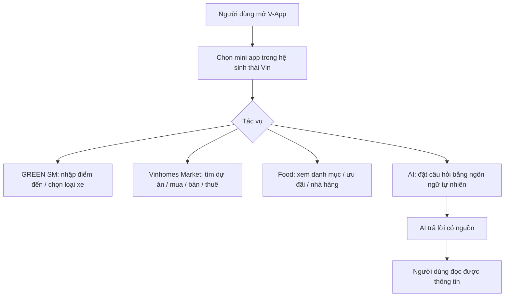
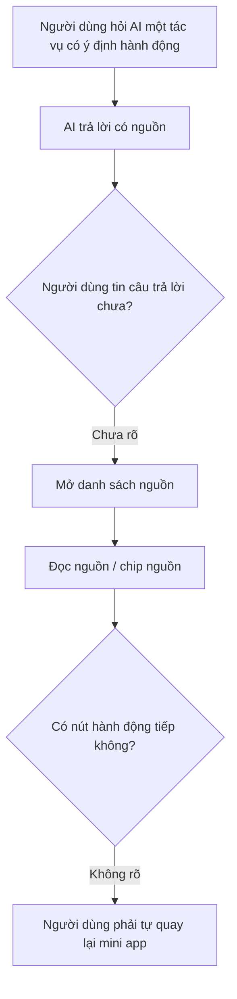
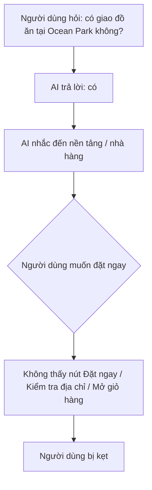
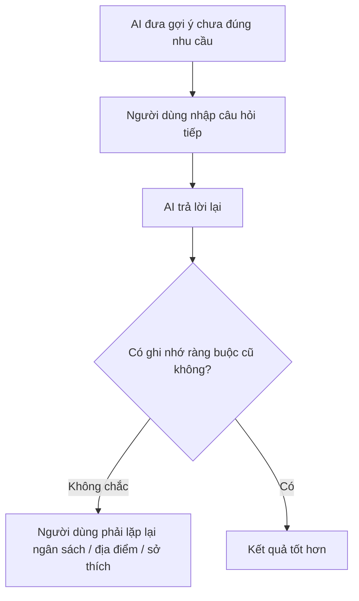
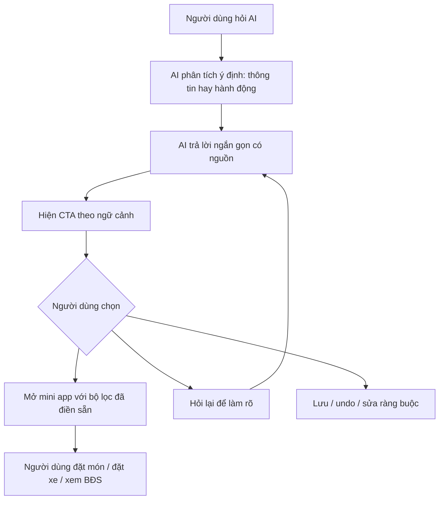

# Nhận xét V-App - hệ sinh thái mini app của VinGroup

## 1. Dùng thử

### Promise đọc được từ trải nghiệm

V-App đang hướng tới vai trò "một cửa vào hệ sinh thái Vin": người dùng có thể vào cùng một app để:

- Đặt xe qua GREEN SM.
- Đặt đồ ăn / tìm ưu đãi ăn uống.
- Tìm, mua, bán, thuê bất động sản Vinhomes.
- Hỏi đáp bằng AI ngay trong app, có kèm nguồn tham khảo.

Promise lớn nhất không chỉ là "có nhiều mini app", mà là "hỏi bằng ngôn ngữ tự nhiên rồi chuyển tiếp thành hành động trong hệ sinh thái Vin".

### Màn hình đã chụp

- Bất động sản Vinhomes Market: `z7895776048880_e0fb6e2e0bb5cadc3df551c6512c1efc.jpg`
- Đặt đồ ăn / ưu đãi ăn uống: `z7895776053855_7e18eed298800f7ea7598ceff884ec45.jpg`
- AI hỏi món ăn tại VinUni dưới 40.000 VND: `z7895776123011_b8473d80f78bfc0e4464662c7692ef18.jpg`
- GREEN SM đặt xe: `z7895776138758_07f03d2c5cbdf86297e117e6062bcc6e.jpg`
- AI hỏi giao đồ ăn tại Ocean Park: `z7895776141495_0d3cfd97c9d86dff69583f624c52b004.jpg`
- AI hỏi điểm du lịch biển hè 2026: `z7895776153302_a27dbe11ff394cc71980d361aa654047.jpg`

### Query thật đã thử

#### Query 1: "Đề xuất món ăn giao đến VinUni dưới 40.000 VND"

Kỳ vọng:

- App hiểu địa điểm VinUni.
- Lọc món theo ngân sách dưới 40.000 VND.
- Ưu tiên món có thể đặt / giao ngay.
- Có nút "Đặt món", "Xem quán gần đây", hoặc "Mở mini app đồ ăn".

Thực tế:

- AI trả lời khá tốt về mặt nội dung, có gợi ý căn tin trường, The Little Kitchen & Foodology, Fresh Garden.
- Có hiển thị "Đã xem xét 7 nguồn" và chip nguồn như `vinuni`, `foody`, `grab`.
- Điểm gãy: câu trả lời dừng ở mức tư vấn. Người dùng vẫn phải tự tìm cách chuyển sang đặt món. Không có CTA rõ ràng để mở mini app đồ ăn với bộ lọc sẵn có.

#### Query 2: "Ở Ocean Park có giao đồ ăn tận nơi không?"

Kỳ vọng:

- App xác nhận khu Ocean Park có giao đồ ăn hay không.
- Nếu có, đưa ra các cách đặt phù hợp trong hệ sinh thái / đối tác.
- Có nút tiếp tục: "Đặt đồ ăn tại Ocean Park", "Xem nhà hàng nội khu", "Kiểm tra địa chỉ của tôi".

Thực tế:

- AI trả lời có giao đồ ăn tận nơi tại Vinhomes Ocean Park.
- Có hiển thị "Đã xem xét 16 nguồn" và chip nguồn như `shopeefood`, `market`.
- Điểm gãy: AI nói có thể đặt qua ShopeeFood/GrabFood, nhưng không liên kết thành hành động trong app. Người dùng khảo sát xong vẫn bị rơi sang tư duy "giờ mình bấm đâu?".

#### Query 3: hỏi gợi ý điểm du lịch biển hè 2026

Kỳ vọng:

- AI đưa danh sách điểm đến, có nguồn.
- Nếu nằm trong ecosystem, nên gợi ý tiếp đặt xe, đặt lịch, xem ưu đãi hoặc lưu itinerary.

Thực tế:

- AI trả lời danh sách khá đầy đủ, có nguồn như `pystravel`, `baomoi`.
- Điểm gãy nhẹ: đây là câu hỏi ngoài tác vụ cốt lõi của Vin ecosystem, nên app trả lời được nhưng không có bước tiếp theo có giá trị cao. Nếu chỉ là hỏi đáp thông tin, V-App chưa khác biệt rõ với các AI chat app khác.

## 2. Vẽ flow as-is

### Happy path

Happy path hiện tại dùng tốt ở mức "tìm thấy thông tin" và "mở được mini app". Giao diện các mini app khá quen thuộc: có thanh tìm kiếm, danh mục, banner ưu đãi, lịch sử địa điểm, tab dịch vụ.

### Low-confidence path

Điểm kẹt: sau khi đọc nguồn, app chưa giúp người dùng biến thông tin thành hành động. Ví dụ: "món dưới 40.000 VND tại VinUni" nên có nút lọc sẵn kết quả trong mini app Food.

### Failure path

Điểm kẹt rõ nhất: khoảnh khắc người dùng đã được thuyết phục nhưng không có đường đi tiếp.

### Correction path

Điểm kẹt: correction hiện tại phụ thuộc nhiều vào việc người dùng tự nói lại. App nên có các nút sửa nhanh để tránh bắt người dùng gõ lại.

## 3. Sửa một path yếu nhất

### Path yếu nhất

"Hỏi AI để tìm đồ ăn / dịch vụ" -> "AI trả lời" -> "người dùng muốn hành động" -> "không có CTA rõ ràng".

Đây là path yếu vì nó nằm đúng promise của V-App: hỏi tự nhiên và dùng hệ sinh thái Vin. Nếu AI chỉ trả lời mà không mở đường sang đặt xe, đặt món, tìm BĐS, thì lợi thế ecosystem bị giảm.

### To-be đề xuất

### Các thay đổi cụ thể

#### 1. Hỏi lại khi thiếu thông tin

Nếu query là "có giao đồ ăn tận nơi không?", AI nên hỏi tiếp hoặc hiện chip:

- "Bạn đang ở Ocean Park 1, 2 hay 3?"
- "Giao đến căn hộ hay văn phòng?"
- "Muốn ăn ngay hay đặt trước?"

#### 2. Thêm source có tác dụng

Nguồn hiện tại có, nhưng đang giống citation hơn là công cụ. Nên cho mỗi source 2 hành động:

- "Mở nguồn"
- "Dùng nguồn này để tìm trong app"

Ví dụ chip `market` có thể dẫn sang danh sách cửa hàng / nhà hàng nội khu, không chỉ là nhãn nguồn.

#### 3. Thêm button hành động ngay trong câu trả lời AI

Với query VinUni dưới 40.000 VND:

- "Xem món dưới 40K gần VinUni"
- "Lọc quán có giao hàng"
- "Mở ưu đãi bữa trưa"
- "Đặt GREEN SM đến VinUni"

Với query Ocean Park:

- "Kiểm tra địa chỉ giao"
- "Xem nhà hàng tại Ocean Park"
- "Mở mini app đồ ăn"
- "Hỏi nhân viên hỗ trợ"

#### 4. Undo và sửa nhanh

Sau khi AI áp dụng bộ lọc, hiện một dòng:

`Đang tìm: VinUni | dưới 40.000 VND | giao tận nơi`

Kèm các nút:

- "Sửa địa điểm"
- "Tăng ngân sách"
- "Bỏ lọc giao hàng"
- "Hoàn tác"

#### 5. Handoff khi AI không chắc

Khi AI có độ tin cậy thấp hoặc nguồn trái nhau, thay vì trả lời chắc chắn, nên nói rõ:

"Mình chưa xác nhận được khả năng giao theo thời gian thực. Bạn có muốn mình mở mini app đồ ăn để kiểm tra theo địa chỉ hiện tại không?"

CTA:

- "Kiểm tra ngay"
- "Nhập địa chỉ khác"
- "Gặp hỗ trợ"

#### 6. Correction log

Nên lưu lại các ràng buộc người dùng đã sửa:

- Lần 1: "dưới 40.000 VND"
- Lần 2: "chỉ lấy món giao được"
- Lần 3: "gần VinUni"

Log này giúp AI không quên context và giúp người dùng thấy vì sao kết quả thay đổi.

## Kết luận ngắn

V-App đã có nền tảng tốt: mini app ecosystem rõ, màn hình đặt xe / đồ ăn / bất động sản dễ hiểu, AI có nguồn và trả lời khá hữu ích. Điểm cần nâng cấp nhất là cầu nối giữa "AI biết" và "app làm được". Nếu thêm các CTA theo ngữ cảnh, hỏi lại khi thiếu thông tin, source có thể bấm hành động, undo và correction log, V-App sẽ gần hơn với promise "một trợ lý hành động cho hệ sinh thái Vin" thay vì chỉ là một lớp hỏi đáp nằm bên trên các mini app.
