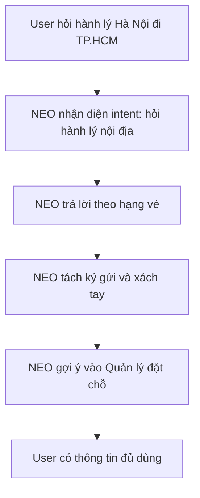
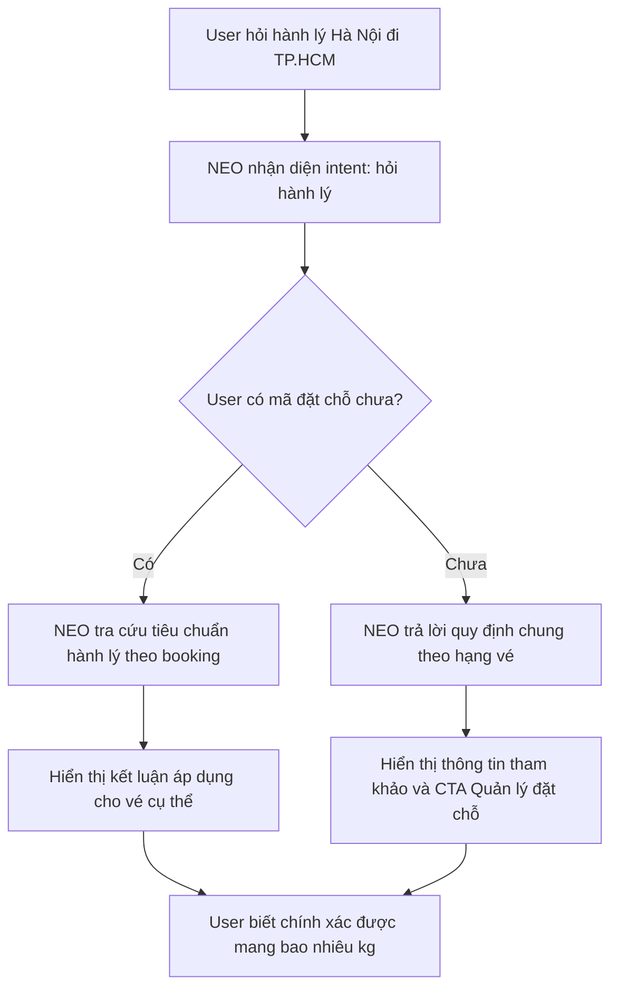
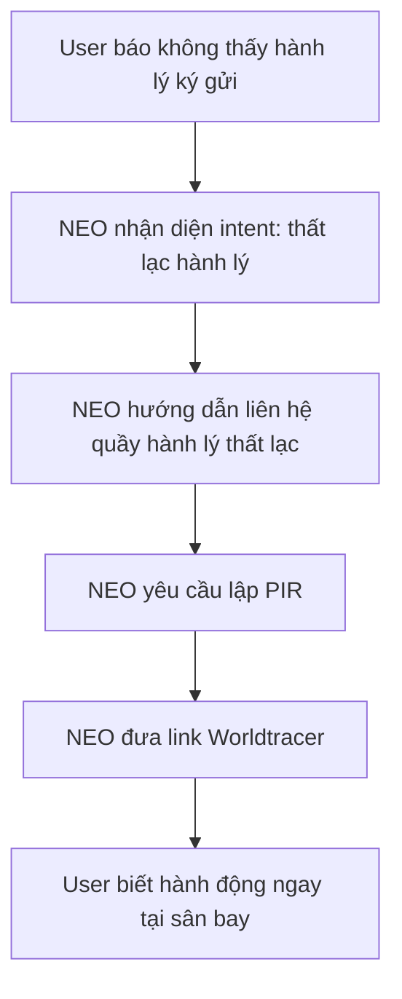
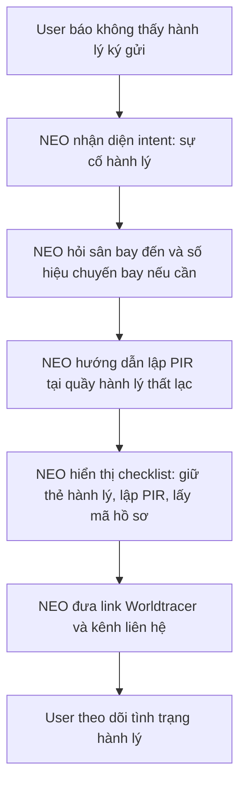
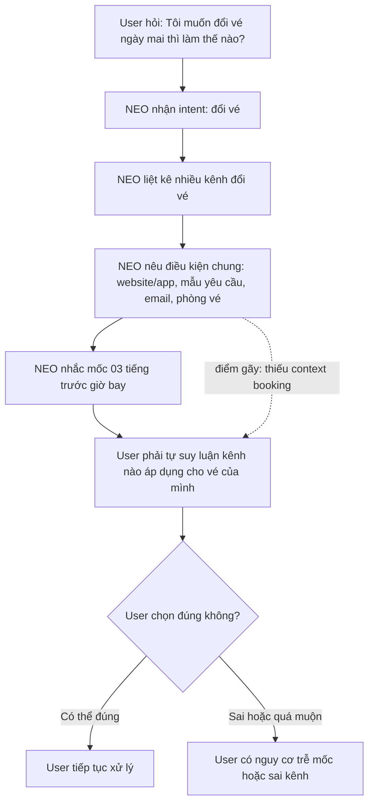
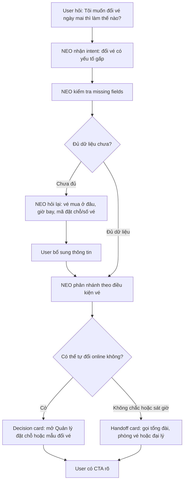
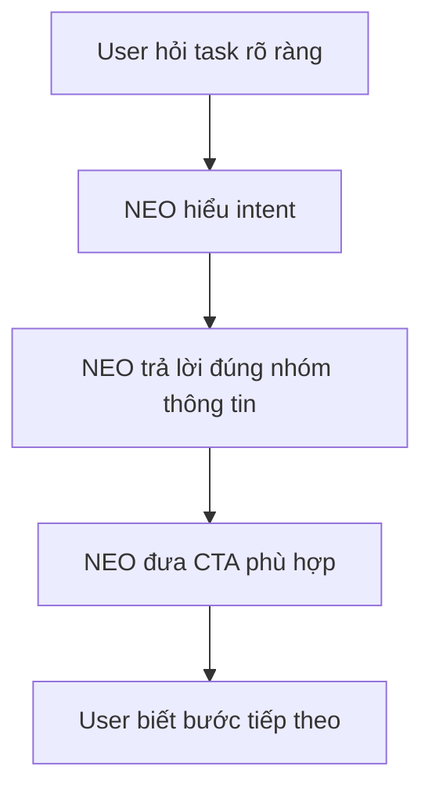
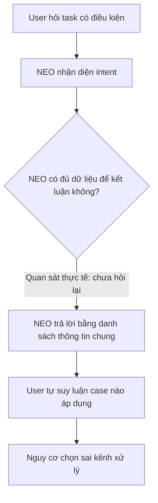
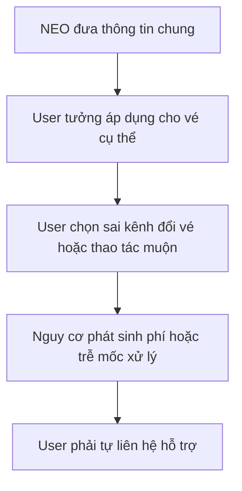
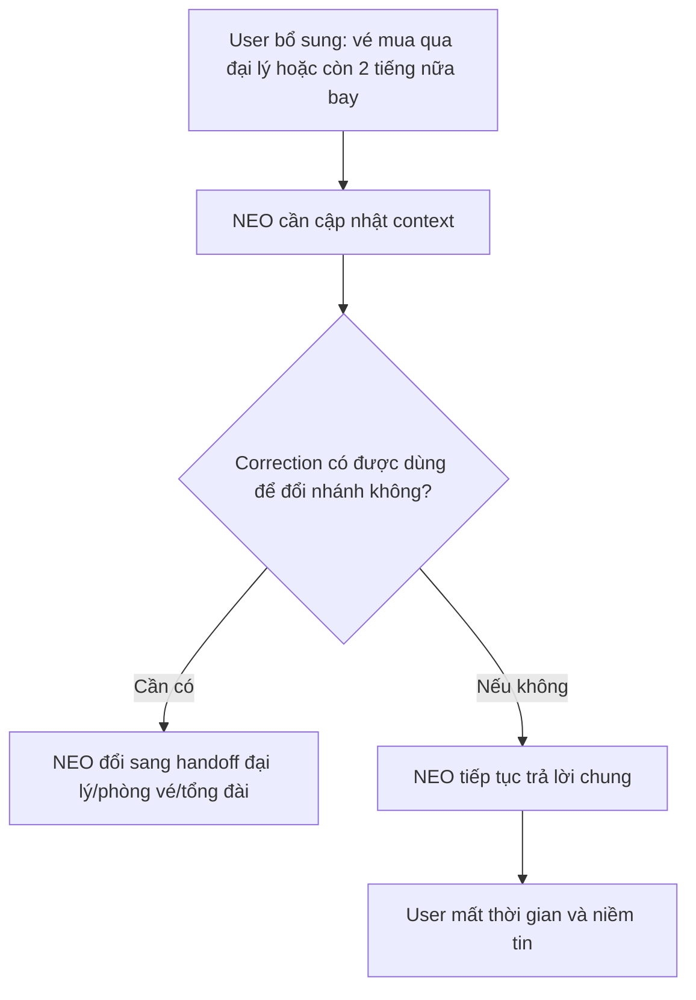

# Workshop — Mổ App AI Thật

**Sản phẩm được chọn:** Vietnam Airlines — NEO  
**AI feature:** Trợ lý ảo/chatbot hỗ trợ vé, hành lý, hoàn/đổi vé, thủ tục hàng không và khiếu nại  
**Thời gian thực hiện:** 35-45 phút  
**Hình thức:** cá nhân trước, chia sẻ theo nhóm sau  
**Output:** finding note + sketch `as-is / to-be`  

Mục tiêu không phải chấm "UI đẹp hay xấu". Mục tiêu là dùng sản phẩm thật như một bài needfinding: tìm chỗ product gãy trong workflow thật, rồi viết finding đó thành quyết định product.

---

## 1. Chọn một sản phẩm để dùng thử

| Sản phẩm | AI feature | Cách truy cập |
| --- | --- | --- |
| MoMo — Moni | Trợ thủ tài chính, phân tích chi tiêu, chatbot | App MoMo |
| **Vietnam Airlines — NEO** | **Chatbot hỗ trợ vé, hành lý, khiếu nại, hoàn/đổi vé** | **Website/Zalo VNA** |
| V-App — V-AI | Trợ lý voice/text, gợi ý theo ngữ cảnh | App V-App |
| App theo track nhóm | App thật nhóm đang chọn cho hackathon | Cần screenshot/link |

**Sản phẩm được chọn:** Vietnam Airlines — NEO.

**Lý do chọn:**  
NEO nằm trong workflow có rủi ro cao hơn chatbot thông tin thông thường. Người dùng có thể dựa vào câu trả lời của bot để ra quyết định liên quan đến hành lý, thời hạn khiếu nại, đổi vé, phí no-show hoặc kênh hỗ trợ chính thức. Vì vậy, điểm cần mổ không chỉ là bot trả lời đúng hay sai, mà là bot có biết khi nào cần hỏi lại, khi nào cần đưa nguồn, và khi nào cần chuyển sang tư vấn viên hay không.

---

## 2. Dùng thử: promise vs reality

### 2.1. Product hứa gì?

Vietnam Airlines giới thiệu NEO là trợ lý ảo hỗ trợ 24/7 cho các câu hỏi liên quan đến hành trình, mua vé, thanh toán và nhiều tính năng khác.

NEO được kỳ vọng có thể:

* Tra cứu thông tin vé máy bay, chuyến bay và hành lý.
* Giải đáp thông tin mua vé và hành lý.
* Kiểm tra thông tin hành trình, tình trạng đặt chỗ, giá vé.
* Hướng dẫn làm thủ tục và giấy tờ cần chuẩn bị.
* Chuyển hướng gặp tư vấn viên khi NEO chưa thể giải đáp.

### 2.2. User nào được hứa sẽ được giúp?

Nhóm user chính:

* Hành khách đang chuẩn bị bay.
* Hành khách cần kiểm tra hành lý trước chuyến bay.
* Hành khách vừa gặp sự cố sau chuyến bay, ví dụ thất lạc hành lý.
* Hành khách cần hoàn/đổi vé nhưng không chắc kênh xử lý.
* Người bay lần đầu, cần hướng dẫn nhanh và rõ.

### 2.3. Kỳ vọng AI làm được task nào?

Tôi kỳ vọng NEO có thể làm tốt các task sau:

1. **Hỏi quy định hành lý theo hành trình**

   * Nhận diện chặng bay nội địa/quốc tế.
   * Trả lời theo hạng vé.
   * Gợi ý kiểm tra booking nếu cần kết quả chính xác cho vé cụ thể.

2. **Hỗ trợ sự cố hành lý tại sân bay**

   * Ưu tiên hành động ngay tại sân bay.
   * Nêu rõ bước cần làm trước: liên hệ quầy hành lý thất lạc, lập PIR.
   * Đưa link hoặc kênh tra cứu chính thức.

3. **Hướng dẫn đổi vé trong tình huống gấp**

   * Không trả lời chung chung nếu thiếu dữ liệu.
   * Hỏi lại kênh mua vé, giờ bay, mã đặt chỗ/số vé, điều kiện vé.
   * Cảnh báo mốc thời gian quan trọng như 03 tiếng trước giờ bay.
   * Chuyển sang tư vấn viên/phòng vé khi case có rủi ro.

---

### 2.4. Prompt/input đã thử

### Query 1 — Hành lý nội địa Hà Nội đi TP.HCM

```text
tôi bay từ Hà Nội đi Tp.HCM thì được mang theo bao nhiêu kg hành lý
```

### Query 2 — Không thấy hành lý ký gửi tại sân bay

```text
Tôi vừa xuống sân bay nhưng không thấy hành lý ký gửi, tôi phải làm gì?
```

### Query 3 — Đổi vé ngày mai

```text
Tôi muốn đổi vé ngày mai thì làm thế nào?
```

---

## 2.5. Hành vi quan sát được

| Query | User input | NEO trả lời chính | Đánh giá nhanh |
| --- | --- | --- | --- |
| Chào hỏi | "hi chào cậu" | NEO chào lại và gợi ý phạm vi hỗ trợ: hành lý, hoàn/đổi vé, thủ tục hàng không. | Onboarding ổn, bot định hướng user vào đúng miền hỗ trợ. |
| Query 1 — Hành lý nội địa | "tôi bay từ Hà Nội đi Tp.HCM thì được mang theo bao nhiêu kg hành lý" | NEO trả lời theo hành trình nội địa, tách hành lý ký gửi và xách tay. Bot nêu mức 32kg, 23kg, 18kg, 12kg theo hạng vé và gợi ý vào Quản lý đặt chỗ để kiểm tra chính xác. | Happy path tốt: câu trả lời cụ thể, có phân loại và có CTA kiểm tra booking. |
| Query 2 — Thất lạc hành lý | "Tôi vừa xuống sân bay nhưng không thấy hành lý ký gửi, tôi phải làm gì?" | NEO hướng dẫn liên hệ quầy hành lý thất lạc ở sân bay đến để lập PIR, sau đó tra cứu Worldtracer qua link `https://mybag.aero/baggage/#/pax/vna/vi-vi/faqs-and-contact`. | Happy/urgent path tốt: bot ưu tiên hành động ngay tại sân bay, có link tiếp theo. |
| Query 3 — Đổi vé ngày mai | "Tôi muốn đổi vé ngày mai thì làm thế nào?" | NEO liệt kê nhiều cách đổi vé: website/app, Quản lý đặt chỗ, mẫu yêu cầu đổi vé, email, phòng vé. Bot nêu điều kiện chỉ áp dụng cho vé mua trên website/app và cần đổi ít nhất 03 tiếng trước giờ khởi hành để tránh no-show. | Có ích nhưng là low-confidence path: bot chưa hỏi vé mua ở đâu, mã đặt chỗ, giờ bay ngày mai, điều kiện vé. User vẫn phải tự suy luận phương án nào áp dụng cho mình. |

### Observation 1 — Query hành lý nội địa

NEO hiểu đúng intent và trả lời có cấu trúc. Bot tách rõ hành lý ký gửi và hành lý xách tay, đồng thời phân biệt theo hạng vé.

**Điểm tốt:** Có CTA hợp lý: vào Quản lý đặt chỗ để tra cứu chính xác tiêu chuẩn hành lý của vé.

---

### Observation 2 — Query thất lạc hành lý

NEO đưa hướng dẫn đúng thứ tự ưu tiên: liên hệ ngay quầy hành lý thất lạc ở sân bay đến để lập PIR, sau đó tra cứu Worldtracer.

**Điểm tốt:** Với tình huống khẩn, bot không trả lời lan man mà hướng user đến hành động cần làm ngay.

---

### Observation 3 — Query đổi vé ngày mai

NEO cung cấp nhiều thông tin hữu ích, nhưng chưa hỏi lại các điều kiện quyết định như kênh mua vé, giờ khởi hành, mã đặt chỗ, điều kiện giá vé hoặc hành trình cụ thể.

**Điểm gãy:** AI trả lời theo dạng danh sách thông tin chung trong khi user cần một quyết định áp dụng cho case thật: vé của tôi có tự đổi online được không, cần dùng kênh nào, và còn kịp trước mốc 03 tiếng không?

---

## 3. Vẽ 4 paths

| Path | Câu hỏi cần trả lời | Quan sát trên NEO |
| --- | --- | --- |
| Happy | Khi AI đúng và tự tin,<br>user thấy gì? | Câu hỏi hành lý nội địa được trả lời rõ theo hạng vé.<br>NEO tách ký gửi/xách tay và gợi ý Quản lý đặt chỗ.<br>User có thể hành động tiếp. |
| Low-confidence | Khi AI không chắc,<br>hệ thống có hỏi lại hoặc show options không? | Với câu hỏi đổi vé ngày mai, NEO chưa hỏi lại kênh mua vé, giờ bay, mã đặt chỗ, điều kiện vé.<br>Bot trả lời dài nhưng user vẫn phải tự chọn kênh xử lý. |
| Failure | Khi AI sai hoặc quá chung,<br>user biết và sửa bằng cách nào? | Failure chưa xảy ra trực tiếp trong test.<br>Nhưng có rủi ro user tưởng mọi vé đều đổi online được, thao tác sai kênh hoặc trễ mốc 03 tiếng trước giờ bay. |
| Correction | Khi user sửa,<br>correction có được lưu/log không? | Chưa thấy bằng chứng NEO có correction log.<br>Nếu user bổ sung "vé mua qua đại lý" hoặc "còn 2 tiếng nữa bay", bot cần đổi nhánh trả lời ngay trong phiên. |

---

# 4. Finding thành quyết định product

## Finding 1 — NEO trả lời hữu ích nhưng chưa đủ context cho tác vụ đổi vé

```text
Khi user hỏi NEO "Tôi muốn đổi vé ngày mai thì làm thế nào?",
AI/product trả lời một danh sách dài các kênh đổi vé và điều kiện chung,
nhưng chưa hỏi các thông tin quyết định như kênh mua vé, mã đặt chỗ,
giờ khởi hành, điều kiện giá vé hoặc hành trình cụ thể.

Hậu quả là user có thể tưởng mình đổi được trên website/app,
trong khi vé có thể mua qua đại lý, không đủ điều kiện đổi,
hoặc đã gần giờ bay nên cần xử lý qua kênh khác để tránh phí no-show.

Lỗi thuộc layer Intent + Data-tool + Safety + UX Recovery.
Nên sửa bằng requirement: trước khi hướng dẫn đổi vé, NEO phải kích hoạt
low-confidence path để hỏi lại thông tin bắt buộc hoặc chuyển tư vấn viên
nếu không đủ dữ liệu.
```

**Product decision:**  
Không nên ưu tiên làm câu trả lời đổi vé dài hơn. Cần ưu tiên cơ chế **clarification before instruction**: với task đổi vé, NEO phải hỏi lại kênh mua vé, giờ bay và mã đặt chỗ/số vé trước khi đưa ra hướng dẫn cuối cùng.

---

## Finding 2 — NEO cần phân biệt thông tin chung với quyết định áp dụng cho booking

```text
Khi user hỏi về hành lý hoặc đổi vé,
NEO có thể đưa thông tin chính sách chung khá tốt,
nhưng chưa luôn phân biệt rõ "đây là thông tin tham khảo" với
"đây là kết luận áp dụng cho booking của bạn".

Hậu quả là user có thể dùng thông tin chung như hướng dẫn chính thức cho vé cụ thể,
đặc biệt trong các case phụ thuộc hạng vé, điều kiện giá, kênh mua và thời gian bay.

Lỗi thuộc layer Data-tool + UX Recovery.
Nên sửa bằng requirement: với tác vụ phụ thuộc booking,
NEO phải hiển thị trạng thái "cần kiểm tra booking" hoặc "đã đủ dữ liệu để kết luận".
```

**Product decision:**  
NEO cần dùng **decision card** cho các câu trả lời có rủi ro: card phải nêu kết luận, điều kiện áp dụng, dữ liệu còn thiếu, source và CTA tiếp theo.

---

## Finding 3 — Correction path chưa rõ

```text
Khi user bổ sung thông tin sau câu trả lời đầu,
ví dụ "vé tôi mua qua đại lý" hoặc "chuyến bay còn 2 tiếng nữa",
product cần đổi nhánh trả lời ngay.

Nếu correction không được lưu trong phiên,
user phải tự kiểm soát lỗi và có thể tiếp tục nhận hướng dẫn chung không phù hợp.

Lỗi thuộc layer UX Recovery + Correction Log.
Nên sửa bằng requirement: mỗi decision card phải có nút sửa thông tin
và NEO phải cập nhật câu trả lời dựa trên correction mới.
```

**Product decision:**  
NEO cần có correction loop. User không chỉ chat tiếp, mà phải có cách sửa có cấu trúc như `Sửa kênh mua vé`, `Sửa giờ bay`, `Gặp tư vấn viên`.

---

# 5. Sketch as-is / to-be

## 5.1. Flow 1 — Hỏi hành lý Hà Nội đi TP.HCM

### As-is



### To-be



---

## 5.2. Flow 2 — Không thấy hành lý ký gửi tại sân bay

### As-is



### To-be



---

## 5.3. Flow 3 — Đổi vé ngày mai

### As-is



### To-be



---

# 6. Tổng hợp 4 paths cho NEO

## 6.1. Happy path



**Ví dụ quan sát:**  
Với câu hỏi hành lý Hà Nội đi TP.HCM, NEO trả lời theo hạng vé và gợi ý vào Quản lý đặt chỗ.

---

## 6.2. Low-confidence path



**Vấn đề:**  
Low-confidence path chưa rõ trong câu hỏi đổi vé. Bot nên hỏi lại trước khi đưa hướng dẫn cuối.

---

## 6.3. Failure path



**Vấn đề:**  
Failure chưa xảy ra trực tiếp trong test, nhưng rủi ro xuất hiện rõ ở task đổi vé ngày mai.

---

## 6.4. Correction path



**Vấn đề:**  
Chưa thấy correction log rõ ràng. Product cần nút sửa thông tin và lưu correction trong phiên.

---

# 7. Finding note cuối cùng

## Finding chính

```text
Khi user dùng NEO cho task đổi vé có rủi ro thời gian và tiền,
AI trả lời nhiều thông tin đúng nhưng chưa hỏi đủ dữ liệu quyết định,
hậu quả là user vẫn phải tự suy luận vé của mình có đổi online được không,
cần dùng kênh nào, và còn kịp trước mốc 03 tiếng hay không.
Lỗi thuộc layer Intent + Data-tool + Safety + UX Recovery.
Nên sửa bằng low-confidence path: kiểm tra missing fields,
hỏi lại hoặc chuyển tư vấn viên trước khi đưa hướng dẫn cuối cùng.
```

## Product decision

```text
NEO không nên chỉ tối ưu để trả lời nhanh và dài.
SPEC cần bổ sung requirement: với các task có rủi ro như đổi vé,
hoàn vé, hành lý thất lạc hoặc khiếu nại, AI phải thực hiện bước context check:
1. xác định dữ liệu bắt buộc,
2. đánh dấu dữ liệu đang thiếu,
3. hỏi lại hoặc yêu cầu user xác nhận,
4. chỉ đưa decision card cuối cùng khi đủ dữ liệu hoặc khi user chọn gặp tư vấn viên.
```

---

# 8. SPEC change đề xuất

## Requirement 1 — Missing field detection

```text
NEO must detect missing critical fields before giving final instructions in high-impact airline tasks such as ticket change, refund, baggage incident, and passenger information correction.
```

Ví dụ:

| Task | Missing fields cần hỏi |
| --- | --- |
| Đổi vé | kênh mua vé, mã đặt chỗ/số vé, giờ bay, điều kiện giá vé, hành trình một chiều/khứ hồi |
| Hoàn vé | kênh mua vé, hình thức thanh toán, điều kiện vé, trạng thái chuyến bay |
| Hành lý thất lạc | sân bay đến, số hiệu chuyến bay, thẻ hành lý, đã lập PIR chưa |
| Sửa thông tin vé | loại thông tin sai, mã đặt chỗ/số vé, kênh mua vé, thời điểm khởi hành |

---

## Requirement 2 — Decision card

```text
For high-impact tasks, NEO should respond with a decision card instead of only a long text answer.
```

Decision card cần có:

- Kết luận: có thể xử lý online, chưa đủ dữ liệu, hoặc cần gặp tư vấn viên.
- Điều kiện áp dụng.
- Thông tin còn thiếu.
- Source hoặc link chính thức.
- CTA tiếp theo.

---

## Requirement 3 — Handoff rule

```text
If NEO cannot determine the correct action due to missing booking data, urgent timing, or agency-issued ticket, it must offer human handoff.
```

Ví dụ:

| Tình huống | Handoff nên đưa |
| --- | --- |
| Vé mua qua đại lý | Liên hệ đại lý hoặc phòng vé |
| Chuyến bay còn dưới 03 tiếng | Tổng đài/phòng vé để tránh rủi ro no-show |
| Không có mã đặt chỗ | Hỏi thêm hoặc chuyển tư vấn viên |
| Case khiếu nại phức tạp | Kênh khiếu nại chính thức hoặc nhân viên hỗ trợ |

---

## Requirement 4 — Correction loop

```text
NEO should provide structured correction actions after each decision card.
```

Nút/action cần có:

- Sửa kênh mua vé.
- Sửa giờ bay.
- Nhập mã đặt chỗ/số vé.
- Gặp tư vấn viên.
- Báo thông tin chưa đúng.

---

# 9. Tự kiểm trước khi nộp

- [x] Có ít nhất 1 screenshot hoặc observation cụ thể.
- [x] Có transcript tự dùng với 3 câu hỏi thật.
- [x] Có đủ 4 paths hoặc nói rõ path nào chưa có trong product.
- [x] Finding được viết thành product decision, không chỉ là nhận xét.
- [x] Sketch có as-is và to-be.
- [x] Có một câu nói rõ finding này sẽ đổi gì trong SPEC.

---

# 10. Nguồn tham khảo

- Vietnam Airlines — Trợ lý ảo NEO: https://www.vietnamairlines.com/vn/vi/support/chatbot
- Vietnam Airlines — Điều khoản sử dụng Chatbot NEO: https://www.vietnamairlines.com/vn/vi/support/condition-of-chatbot-NEO
- Spirit Vietnam Airlines — Chatbot NEO và hành trình nâng tầm trải nghiệm khách hàng: https://spirit.vietnamairlines.com/chuyen-dong-vna/chatbot-neo-va-hanh-trinh-nang-tam-trai-nghiem-khach-hang.html
